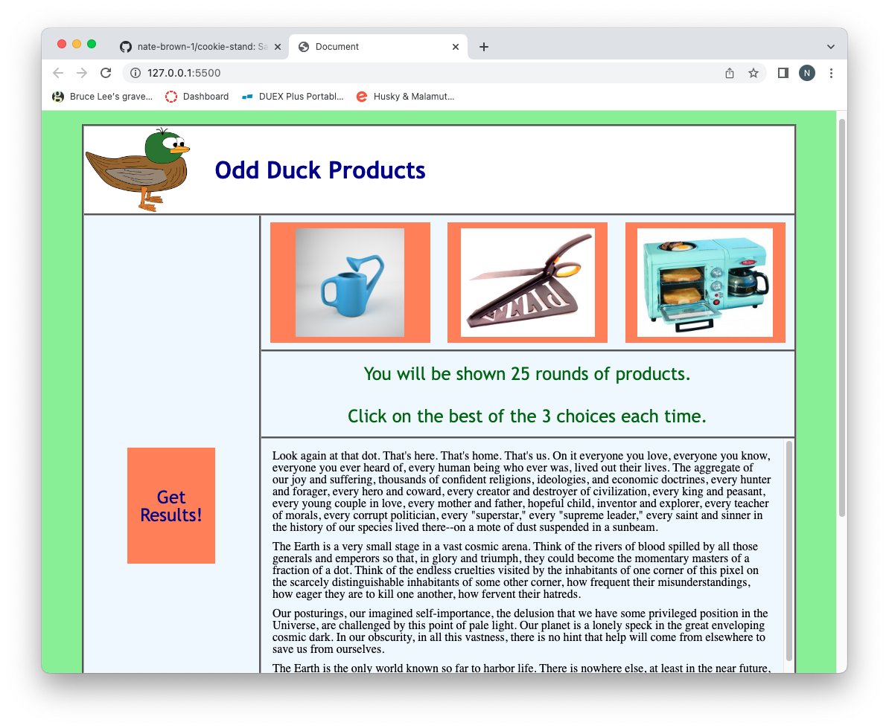
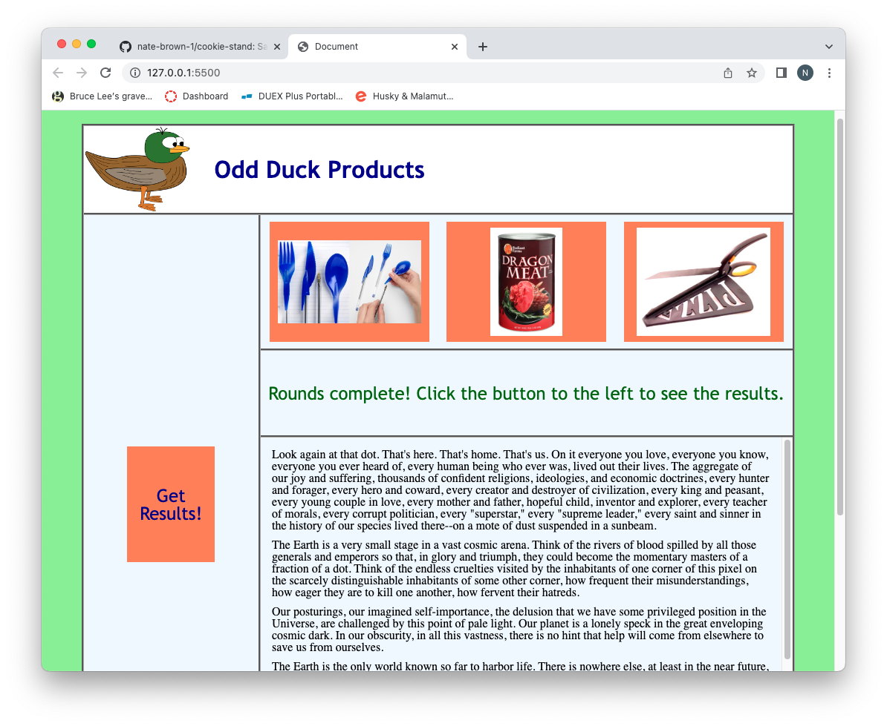
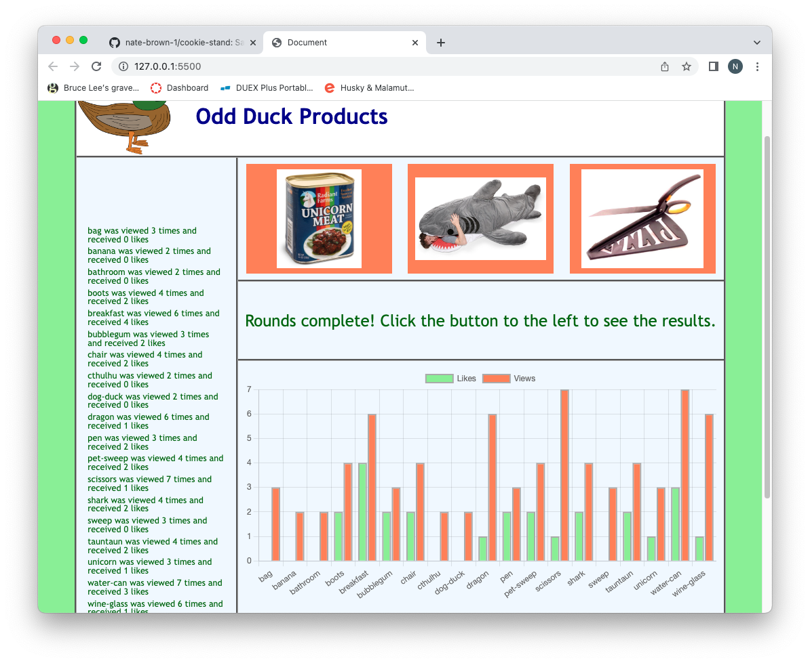
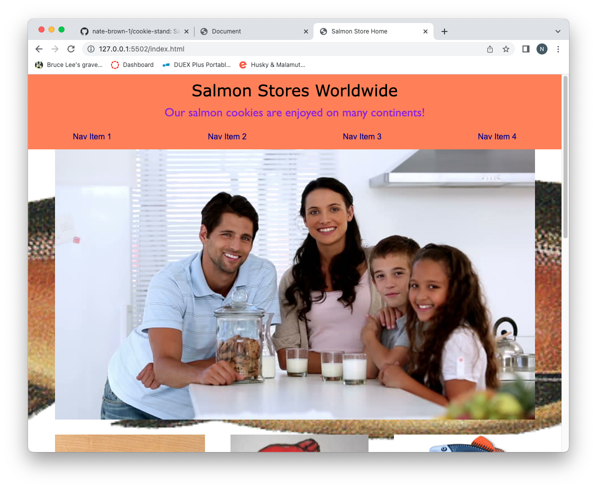
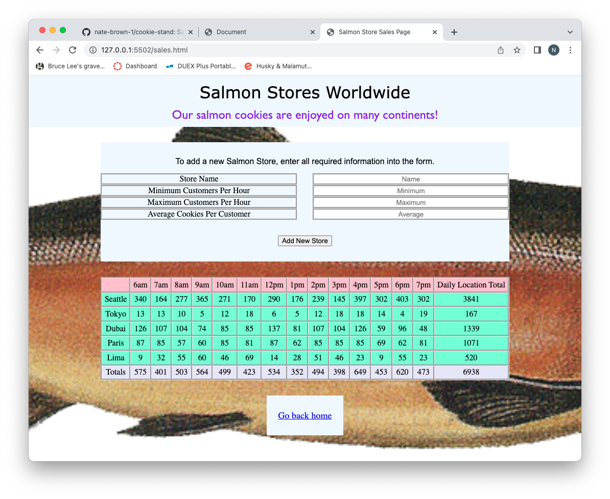
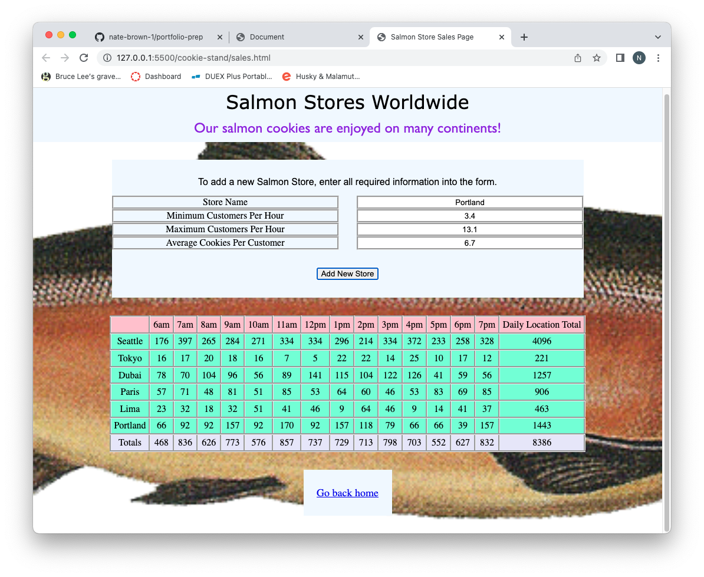

# Portfolio Prep

## Notes for the portfolio

1. A two or three word catchy title. Do NOT use cliches like “programming ninja” or “coding rockstar”.

"Solution Finder"

2. A personal headline, like you have atop your LinkedIn page. What do you want your career to be about?

Software developer, community member, open source advocate.

3. Your professional pitch: You’ve done a recording, so just write down here how it goes.

This was the hardest part of the prework. Not even the actual recording. It's the thought of it that was dreadful. I hate video, whether it's starring me, or anybody else. I don't do Tiktok or Instagram Reels or Youtube. I can't even sit through a 30 minute TV episode.

4. What excites you the most about tech? Write 1-2 sentences.

The thing I love the most is that tech is that it's like making science fiction come ot life. It's about ideas and it's about finding solutions to problems that didn't exist before somebody had those ideas.

## Images

### Head shot

### Screenshots: Odd Duck

### Screenshots: Cookie Stand

